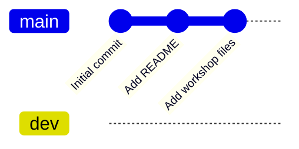
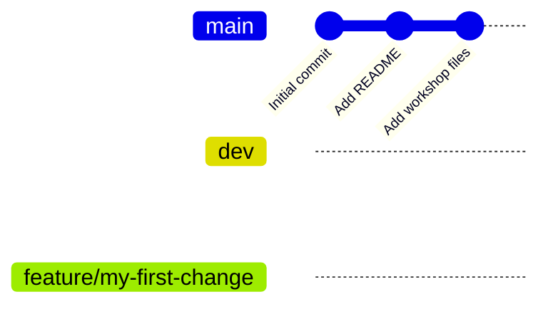
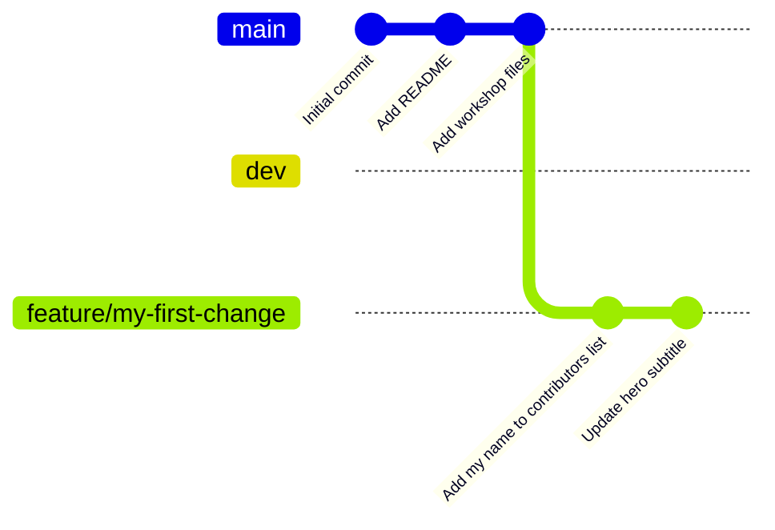
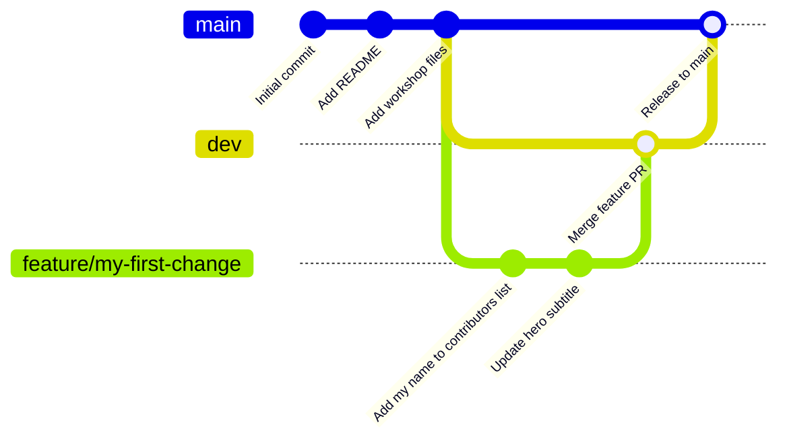

# Git & GitHub Workshop

**Duration:** 45–60 minutes  
**Format:** Live demo + follow-along  
**Prerequisites:** Git installed, GitHub account created

---

## Learning Objectives

By the end of this workshop you will be able to:

- Explain what Git is and why version control matters
- Clone an existing repository from GitHub
- Describe the three-tier branching strategy used by this team
- Create a feature branch, stage changes, commit, and push
- Open a pull request targeting `dev` and merge it
- Sync changes from `dev` to `main` as a release step
- Perform the same workflow in VS Code and RStudio

---

## Part 0: Instructor Setup

*Complete these steps before the workshop. Students do not need to see this section.*

1. Go to `dav-git-demo` on GitHub, click **Use this template > Create a new repository**. Name it something like `dav-git-demo-sp26` and set visibility to Public.
2. In the new session repo, create the `dev` branch: go to the branch dropdown, type `dev`, and click **Create branch: dev**.
3. Go to **Settings > Branches** and add protection rules for both `main` and `dev`: enable *Require a pull request before merging* and disable *Allow direct pushes*.
4. Go to **Settings > Collaborators** and add each student by their GitHub username.
5. Share the session repo URL with students. They will clone that repo, not this template.

---

## Part 1: Setup (5 min)

### Verify Git is installed

```bash
git --version
```

### Configure your identity (one-time setup)

Git tags every commit with your name and email. This only needs to be done once per machine.

```bash
git config --global user.name "Your Name"
git config --global user.email "you@example.com"
```

Verify your config:

```bash
git config --list
```

---

## Part 2: Clone the Repository (5 min)

Cloning downloads a full copy of the repository to your local machine, including all branches and history.

```bash
git clone <repo-url>
cd dav-git-demo
```

Explore what was downloaded:

```bash
git log --oneline        # commit history
git branch -a            # all branches (local + remote)
git remote -v            # where "origin" points
```

**Key concept:** `origin` is just a name; it's an alias for the GitHub URL you cloned from.

When you clone, you get the full commit history of both `main` and `dev`:



---

## Part 3: Branching Strategy (5 min)

This project uses three tiers of branches:

| Branch | Purpose |
|---|---|
| `main` | Always stable and deployable. Nobody commits here directly. |
| `dev` | Integration branch. Finished features land here first. |
| `feature/*` | Short-lived branches for individual pieces of work. |

This structure protects `main` from broken changes. Features get tested together on `dev` before anything reaches `main`.

**Branch protection:** On GitHub, both `main` and `dev` are protected branches. Direct pushes are blocked; changes can only arrive via a pull request.

### Starting any new piece of work

Always sync before branching so you start from the latest state of `dev`:

```bash
git checkout main && git pull    # keep main current
git checkout dev && git pull     # keep dev current
git checkout -b feature/my-first-change   # branch off dev
```

After `git checkout -b feature/my-first-change`, your branch splits off from `dev`. Both `main` and `dev` are untouched:



---

## Part 4: Edit, Stage, Commit (15 min)

This three-step loop is the core Git workflow.

### Step 1: Make a change

Open `index.html` and add your name to the contributors list. Find this section:

```html
<ul id="contributor-list">
  <li>Alice Example</li>
  <li>Bob Example</li>
</ul>
```

Add a new `<li>` with your name:

```html
<ul id="contributor-list">
  <li>Alice Example</li>
  <li>Bob Example</li>
  <li>Your Name</li>
</ul>
```

Save the file and open `index.html` in a browser to confirm your name appears on the page.

### Step 2: See what changed

```bash
git status          # which files are modified
git diff            # line-by-line diff of unstaged changes
```

### Step 3: Stage the change

Staging is a deliberate step: you choose *which* changes go into the next commit. This lets you split unrelated edits into separate commits.

```bash
git add <filename>        # stage a specific file
# or
git add .                 # stage everything in the working directory
```

Check the staged state:

```bash
git status
git diff --staged         # diff of what's about to be committed
```

### Step 4: Commit

```bash
git commit -m "Add my name to contributors list"
```

A good commit message completes the sentence: *"If applied, this commit will..."*

Check the history:

```bash
git log --oneline
```

### Repeat

Make a second change, stage it, and commit. The loop: **edit → `git add` → `git commit`**.

For your second commit, try updating the hero subtitle in `index.html`. Find:

```html
<p>A simple project for learning version control as a team.</p>
```

Change the text to anything you like, then stage and commit with a new message:

```bash
git add index.html
git commit -m "Update hero subtitle"
```

Each commit is a new snapshot on your feature branch. Both `main` and `dev` are still untouched:



---

## Part 5: Push and Pull Request (10 min)

### Push your branch to GitHub

```bash
git push -u origin feature/my-first-change
```

The `-u` flag sets the upstream, so future `git push` and `git pull` on this branch need no extra arguments.

### Open a Pull Request targeting `dev`

1. Go to the repository on GitHub.
2. You'll see a banner: *"Compare & pull request"*. Click it.
3. **Important:** confirm the base branch is set to `dev`, not `main`.
4. Write a short description of what changed and why.
5. Click **Create pull request**.

**What is a PR?** It's a request to merge your branch into another branch. It's also a conversation where teammates can leave comments, request changes, or approve.

### Review and Merge into `dev`

Instructor demonstrates:
- Reading the diff in the PR
- Leaving a review comment
- Approving and merging into `dev`

### Sync your local `dev`

After the PR is merged, update your local copy:

```bash
git checkout dev
git pull
git log --oneline    # your commits are now on dev
```

### Release: merging `dev` into `main`

When the team is satisfied with everything on `dev`, a designated person opens one more PR from `dev` into `main`. This is the release step. After it merges, `main` reflects the new stable version of the site.

```bash
git checkout main
git pull
git log --oneline    # dev's commits are now on main
```

After a full cycle, the commit graph looks like this:



---

## Part 6: Common Situations (5 min)

### Undo a staged file (before committing)

```bash
git restore --staged <filename>
```

### Undo changes to a file (before staging)

```bash
git restore <filename>
```

### See a visual branch graph

```bash
git log --oneline --graph --all
```

### Delete a branch after merging

```bash
git branch -d feature/my-first-change
```

---

## Part 7: GUI Demos (10 min)

The same workflow in graphical tools. Knowing both lets you choose the right tool for the task.

### VS Code: Source Control Panel

| Command-line step | VS Code equivalent |
|---|---|
| `git status` | Files listed under **Changes** in the Source Control panel (`Ctrl+Shift+G`) |
| `git add <file>` | Click **+** next to a file to stage it |
| `git commit -m "..."` | Type message in the box at the top, click the checkmark |
| `git push` | Click the **Sync Changes** button (or the cloud icon in the status bar) |
| `git checkout -b <branch>` | Click the branch name in the bottom-left status bar, then **Create new branch** |

**Live demo:** repeat the edit → stage → commit → push flow entirely in VS Code.

### RStudio: Git Pane

| Command-line step | RStudio equivalent |
|---|---|
| `git status` | Files listed in the **Git** pane (top-right by default) |
| `git add <file>` | Check the box in the **Staged** column |
| `git commit -m "..."` | Click **Commit**, write message, click **Commit** |
| `git push` | Click the green **Push** arrow |
| `git checkout -b <branch>` | Click the branch name in the Git pane, then **New Branch** |

**Live demo:** repeat the same flow in RStudio (especially useful for R/data-science students).

---

## Quick Reference

```
# Start new work
git checkout main && git pull
git checkout dev && git pull
git checkout -b feature/<name>   # branch off dev

# Core loop
git status                       # see what's changed
git diff                         # see line-by-line changes
git add <file>                   # stage a file
git commit -m "message"          # save a snapshot

# Share your work
git push -u origin feature/<name>  # upload branch to GitHub
                                   # then open PR targeting dev on GitHub

# Sync after a merge
git checkout dev && git pull
git log --oneline                # view commit history
```

---

## Resources

- [Pro Git Book (free)](https://git-scm.com/book/en/v2): the definitive reference
- [GitHub Docs](https://docs.github.com): guides for every GitHub feature
- [Oh Shit, Git!](https://ohshitgit.com): plain-English fixes for common mistakes
